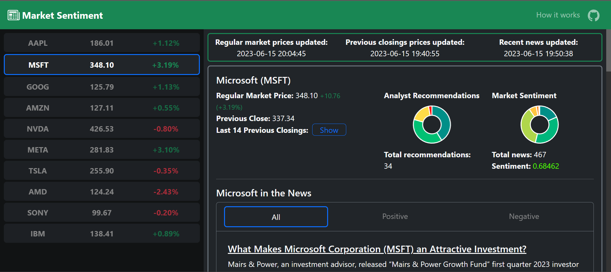

# Market Sentiment
[](https://choosealicense.com/licenses/mit/)
[](https://market-sentiment.onrender.com/)


Market Sentiment is a web app created with Flask and Bootstrap. It uses Yahooquery to fetch the latest stock data and Marketaux to fetch the latest news on said stock. The data is then stored in Firebase Realtime Database and relevant information is displayed on the web app. 

### Features
- Realtime stock data
- Realtime stock news
- Realtime stock sentiment

### Sentiment Analysis
Marketaux's API actually provides the sentiment score for each news, ranging from `-1` to `1`. However, the free version of the API only allows 100 requests per day. To get around this, Market Sentiment sends 6 requests per stock, each request targetting a sentiment range and fetching the news count in that range.

The ranges are as follows:
- `0.15` to `0.39` - Weak Positive
- `0.4` to `0.69` - Moderate Positive
- `0.7` to `1` - Strong Positive
- `-0.15` to `-0.39` - Weak Negative
- `-0.4` to `-0.69` - Moderate Negative
- `-0.7` to `-1` - Strong Negative

The sentiment score is then calculated using the following formula:
```python
raw_sentiment_score = 
  (weak_positive_news_count) * 1 + (moderate_positive_news_count) * 2 + (strong_positive_news_count) * 3 + 
  (weak_negative_news_count) * -1 + (moderate_negative_news_count) * -2 + (strong_negative_news_count) * -3

adjusted_sentiment_score =
  raw_sentiment_score /
    ( 
      (weak_positive_news_count + weak_negative_news_count) * 1 + 
      (moderate_positive_news_count + moderate_negative_news_count) * 2 +
      (strong_positive_news_count + strong_negative_news_count) * 3 +
      100 (bayesian extra value)
    )
```
The bayesian extra values are added to ensure that stocks with less news are not ranked higher than stocks with more news if they have the same sentiment score. 

## Preview



## Environment Variables

To run this project, you will need to add the following environment variables to your `.env` file.

`MARKETAUX_API_TOKEN` - This is your [Marketaux API token](https://www.marketaux.com/).

`FIREBASE_DB_URL` - This is your [Firebase Realtime Database URL](https://firebase.google.com/docs/database).

<br>

In addition, you will need to add `serviceAccountKey.json` to the root directory of this project.
To get `serviceAccountKey.json`:
1. Create your Firebase project
3. Click on the project
4. Click on the gear icon and select Project Settings
5. Click on the Service Accounts tab
6. Click on the Generate new private key button
7. Rename the downloaded JSON file to `serviceAccountKey.json`
8. Place the `serviceAccountKey.json file` in the root directory of the project


## Run Locally

Clone the project

```bash
  git clone https://github.com/EricLin-jpg/Market-Sentiment.git
```

Go to the project directory

```bash
  cd Market-Sentiment
```

### Docker
To run this project with Docker, you will need to [install Docker and Docker Compose](https://docs.docker.com/get-docker/).

Build the Docker image

```bash
  docker-compose build
```

Start the Docker container

```bash
  docker-compose up
```

### Python
If you do not want to use Docker, you can run this project with Python.

Install dependencies

```bash
  pip install -r requirements.txt
```

Start the server

```bash
  python -m app
```

## Built With

**Frontend:** [Bootstrap](https://getbootstrap.com/)

**Charts:** [Chart.js](https://www.chartjs.org/)

**Backend:** [Flask](https://flask.palletsprojects.com/)

**Database:** [Firebase Realtime Database](https://firebase.google.com/docs/database)

**API:** [Yahooquery](https://github.com/dpguthrie/yahooquery), [Marketaux](https://www.marketaux.com/)